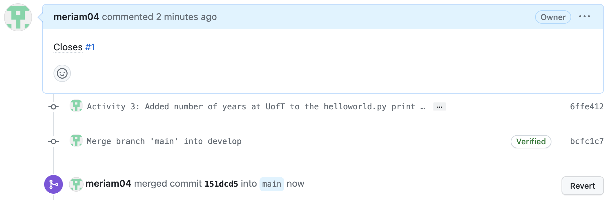
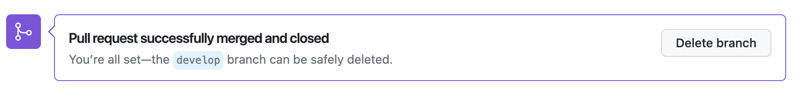
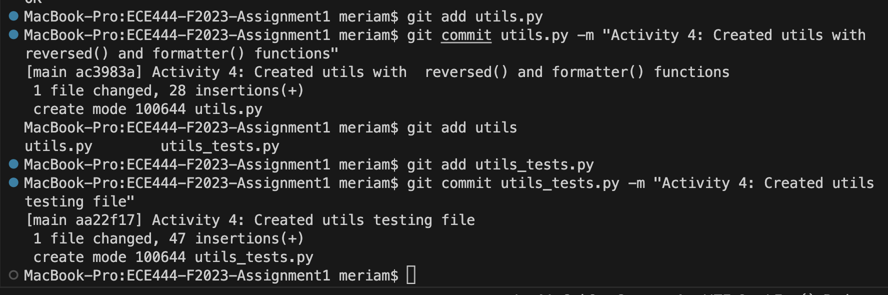
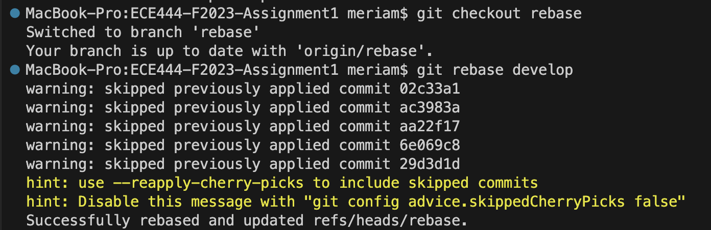
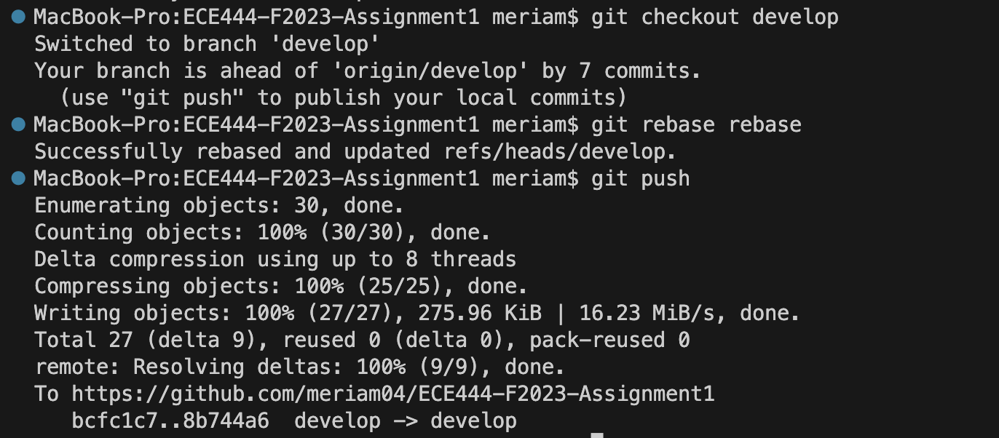

# Meriam Fourati

## Activity 1
Add a screenshot for the commit on GitHub in the README file. Then commit and push
the changes to README.

## Activity 2
Add a screenshot for the output of the merge command on the “main” branch. Commit
and push the changes.

## Activity 3
Add screenshots of the successful merge into your README file on the main branch.
Commit and push the change.

## Activity 4
Add screenshot for the commits into your README file on the main branch. Commit
and push the changes.

## Activity 5
Push all your changes including the “rebase” branch to GitHub. Add a few screenshots
of the commands (along with their outputs) you used for rebase in the README file on
the ‘main’ branch. Commit and push the changes.

