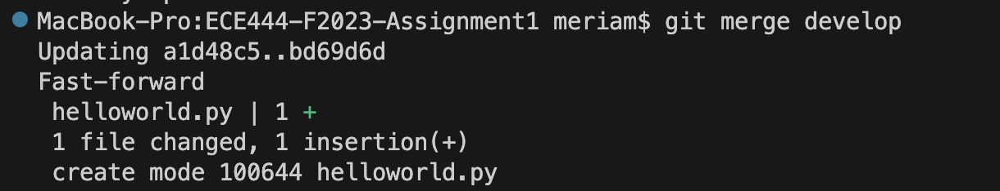

# Meriam Fourati

## Activity 1
Add a screenshot for the commit on GitHub in the README file. Then commit and push
the changes to README.

## Activity 2
Add a screenshot for the output of the merge command on the “main” branch. Commit
and push the changes.

